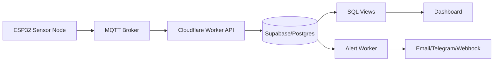
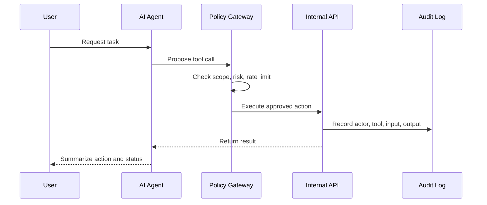
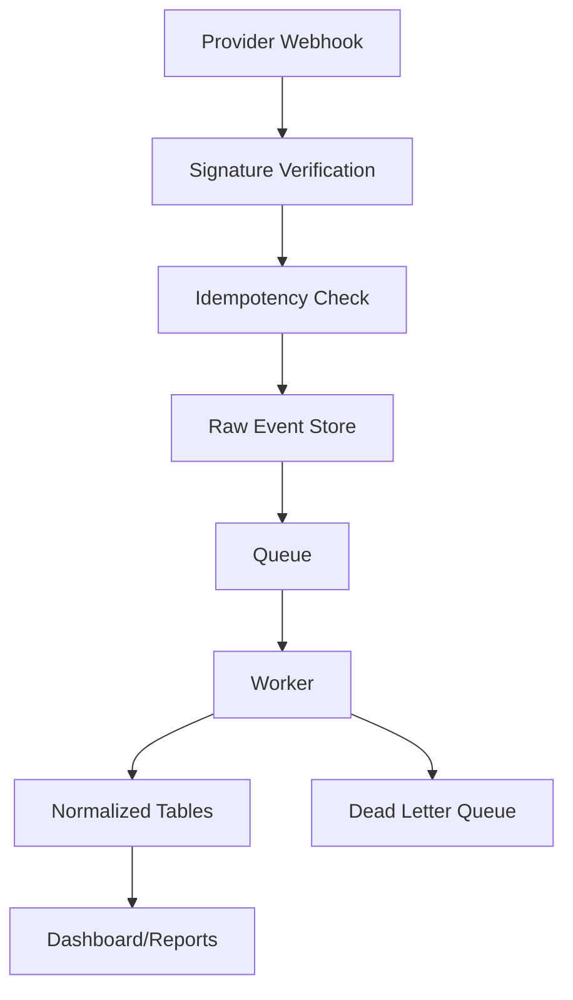

# English Blog Backlog

Created: 2026-06-01

This is the English-only planning backlog for future blog posts. Translations can branch from this file later.

The editorial direction should stay close to Patrick Araujo's current site positioning: backend engineering, automation, API integrations, AI agent systems, cloud infrastructure, cybersecurity, data pipelines, embedded systems, and practical system design. Pop-culture or market topics are welcome when the post translates them into IT architecture, reliability, security, observability, developer tooling, or data engineering.

## Editorial Filter

Use this filter before turning an idea into a post:

- It must teach an IT/system-design concept, not only comment on news.
- It should connect to at least one portfolio strength: Python, Node.js, TypeScript, SQL, Cloudflare Workers, Supabase, GitHub Actions, API integrations, ETL, RAG, local AI, security, observability, or embedded/IoT.
- It should include at least one visual element: architecture diagram, pipeline, sequence diagram, timeline, decision matrix, chart, dashboard mockup, or telemetry graph.
- It should avoid duplicating current posts unless it clearly goes deeper into a new angle.
- It should include a "what I would build" section whenever possible.

## Current Site Coverage To Avoid Repeating

Already covered in the current English blog:

- Ferrari Luce software layer, ECUs, sensors, OTA, fault tolerance, vehicle dynamics, software recalls, and cybersecurity.
- Autonomous coding agents, MCP, spec-driven development, vibe coding, AI-native engineering, multi-AI workflows, AI code governance.
- Lavc Systems architecture and local multi-agent AI platform design.
- API integration workers, OAuth, event-driven integrations, ETL, Supabase SQL, backend automation, monorepos, SaaS architecture, cloud deployment, anomaly detection.
- GTA VI website UX, AAA game launch data engineering, game launch monitoring, global launch spikes, and AAA leak security.

Good follow-ups should be narrower, more visual, more implementation-focused, or tied to newer regional trends.

## Research Signals Checked On 2026-06-01

Recheck these before publishing because trend and regulatory details can move quickly.

- Gartner 2026 strategic technology trends: AI-native development platforms, AI supercomputing, confidential computing, multiagent systems, domain-specific models, physical AI, preemptive cybersecurity, digital provenance, AI security platforms, and geopatriation.
  Source: https://www.gartner.com/en/articles/top-technology-trends-2026
- NIST launched an AI Agent Standards Initiative in February 2026 and published 2026 work on AI agent security, identity, authorization, and secure deployment.
  Source: https://www.nist.gov/news-events/news/2026/02/announcing-ai-agent-standards-initiative-interoperable-and-secure
  Source: https://www.nist.gov/publications/summary-analysis-responses-request-information-regarding-security-considerations-ai
- GitHub Octoverse 2025 says TypeScript became the most used language on GitHub in August 2025, while AI projects and LLM SDK usage grew sharply.
  Source: https://github.blog/news-insights/octoverse/octoverse-a-new-developer-joins-github-every-second-as-ai-leads-typescript-to-1/
- CNCF's 2025 Annual Cloud Native Survey, released in January 2026, frames Kubernetes as a production foundation for AI workloads, with platform engineering, observability, and security as important next steps.
  Source: https://www.cncf.io/announcements/2026/01/20/kubernetes-established-as-the-de-facto-operating-system-for-ai-as-production-use-hits-82-in-2025-cncf-annual-cloud-native-survey/
- Google Cloud's 2026 cybersecurity forecast highlights AI threat hunting, cloud-native SCADA, AI-native architectures, and cyber-physical identity for industrial systems.
  Source: https://cloud.google.com/blog/products/identity-security/cloud-ciso-perspectives-our-2026-cybersecurity-forecast-report
- GSMA/M360 Latin America 2026 highlights 5G, AI, digital trust, a 32% mobile internet usage gap, satellite partnerships, and live AI deployments among operators.
  Source: https://www.m360series.com/latin-america/en/articles/gsma-m360-latam-2026-puts-ai-5g-investment-and-digital-trust-at-the-heart-of-latin-americas-digital-agenda
- EU Digital Decade 2025 points to investment needs in connectivity, semiconductors, sovereign cloud/data infrastructure, AI, quantum, cybersecurity, and digital skills.
  Source: https://digital-strategy.ec.europa.eu/en/policies/2025-state-digital-decade-package
- EU AI Act implementation is moving through a staggered timeline. Transparency rules and high-risk AI timing should be verified before publication.
  Source: https://digital-strategy.ec.europa.eu/en/policies/regulatory-framework-ai
- NIS2 expands cybersecurity obligations across more critical and digital sectors in Europe.
  Source: https://digital-strategy.ec.europa.eu/en/policies/nis2-directive
- S&P Global's APAC 2026 outlook highlights AI momentum, semiconductor/electronics exports, data center growth, regional supply-chain shifts, and technology sovereignty.
  Source: https://www.spglobal.com/market-intelligence/en/news-insights/research/2026/01/key-themes-shaping-apac-2026
- GSMA Asia Pacific 2025 highlights 5G, AI, IoT, fraud, sustainability, and spectrum policy across the region.
  Source: https://www.gsma.com/mobileeconomy/asiapacific/
- Espressif ESP32-C6 combines Wi-Fi 6, Bluetooth 5 LE, and IEEE 802.15.4, making it useful for Matter, Thread, Zigbee, smart home, and low-power IoT posts.
  Source: https://www.espressif.com/en/node/5997

## Priority Queue

Start with these because they match current demand and the site's strongest engineering identity.

- [x] AI Agent Identity and Authorization: OAuth for Non-Human Workers
  Slug: `ai-agent-identity-authorization-oauth`
  Angle: agents need identity, scopes, audit logs, policy boundaries, and revocation.
  Visual: sequence diagram for "human approves agent action -> token issued -> tool call -> audit trail".

- [x] Securing AI Agents Against Prompt Injection, Tool Abuse, and Excess Privilege
  Slug: `securing-ai-agents-prompt-injection-tool-abuse`
  Angle: convert NIST/CAISI concerns into practical backend controls.
  Visual: threat model matrix plus sandboxed tool-call pipeline.

- [x] ESP32 Telemetry Pipeline: From Sensor To Dashboard With MQTT, Workers, Supabase, And SQL
  Slug: `esp32-telemetry-pipeline-mqtt-workers-supabase`
  Angle: hardware plus backend ingestion, replayable data, time-series charts, alerts.
  Visual: full pipeline diagram, sample time-series chart, database table model.

- [x] Kubernetes As The AI Workload Operating System
  Slug: `kubernetes-ai-workload-operating-system`
  Angle: why AI workloads need scheduling, GPUs, observability, model serving, and platform engineering.
  Visual: node pool diagram, GPU scheduling chart, failure-domain map.

- [x] TypeScript Became The Default AI Coding Language: What That Means For Backend Reliability
  Slug: `typescript-ai-coding-backend-reliability`
  Angle: generated code benefits from types, contracts, schemas, tests, and lint gates.
  Visual: compile/test pipeline comparing JavaScript, TypeScript, and Python.

- [x] EU AI Act For Builders: Turning Regulation Into Engineering Requirements
  Slug: `eu-ai-act-engineering-requirements`
  Angle: risk classification, logging, documentation, human oversight, monitoring, and traceability.
  Visual: compliance-to-system-controls mapping.

- [x] Latin America's 5G, AI, And Digital Trust Stack
  Slug: `latin-america-5g-ai-digital-trust-stack`
  Angle: telco AI, fraud prevention, cloud-native networks, digital inclusion, satellite coverage.
  Visual: regional opportunity map and operator AI pipeline.

- [x] APAC AI Infrastructure: Semiconductors, Data Centers, And Software Supply Chains
  Slug: `apac-ai-infrastructure-semiconductors-data-centers`
  Angle: AI is not just models; it is chips, GPUs, supply chains, water, power, and deployment architecture.
  Visual: chip-to-cloud supply-chain map.

- [x] Confidential Computing For AI Pipelines
  Slug: `confidential-computing-ai-pipelines`
  Angle: protect data in use for AI inference, analytics, and regulated workloads.
  Visual: trust-boundary diagram with normal encryption vs confidential compute.

- [x] Digital Provenance, SBOMs, And Signed AI-Generated Code
  Slug: `digital-provenance-sbom-ai-generated-code`
  Angle: prove where code, models, assets, and generated content came from.
  Visual: provenance graph from issue -> agent -> PR -> CI -> artifact -> deploy.

- [x] AI SOC Automation: From Alert Queues To Human-Approved Response Pipelines
  Slug: `ai-soc-automation-human-approved-response`
  Angle: combine security automation, approval gates, SIEM data, and incident runbooks.
  Visual: incident response swimlane.

- [x] The API Layer For AI Agents: MCP, OpenAPI, Webhooks, And Permissioned Tools
  Slug: `api-layer-for-ai-agents-mcp-openapi-webhooks`
  Angle: tools are APIs with identity, quotas, logs, and failure modes.
  Visual: agent tool gateway diagram.

## Visual-First Publishing Checklist

Every new article should aim for this structure:

- Hero: one short technical promise, not a text wall.
- System map: architecture diagram or dependency map in the first third of the article.
- Pipeline: show how data, events, requests, or actions move through the system.
- Chart: one metric-based view, even if illustrative. Examples: latency budget, risk score, cost curve, message volume, token spend, queue depth, sensor readings.
- Implementation box: "What I would build" with stack choices.
- Failure modes: table of risks, symptoms, controls, and observability signals.
- Sidebar: core concepts, standards, protocols, and related internal posts.

Suggested visual primitives for future HTML posts:

- Architecture diagram: services, queues, databases, edge devices, external APIs.
- Sequence diagram: user/agent/system interactions.
- Timeline: regulation dates, release pipeline, incident response phases.
- Heatmap: risk vs impact, adoption vs difficulty, region vs topic.
- Pipeline cards: collect -> validate -> normalize -> store -> analyze -> alert.
- Dashboard mockup: metrics cards, chart area, log stream, recent events.
- Decision matrix: when to use Workers, FastAPI, Supabase, queues, Kubernetes, local LLMs.
- Cost model chart: cloud spend, token spend, GPU hours, storage, egress.

## United States Trend Backlog

- [x] AI Agent Standards And The New Backend Boundary
  Slug: `ai-agent-standards-backend-boundary`
  Angle: NIST, agent interoperability, external tools, and why API contracts become agent contracts.
  Visual: agent ecosystem map.

- [x] AI Agent Security: Why Prompt Injection Is An Authorization Problem
  Slug: `prompt-injection-authorization-problem`
  Angle: treat prompt injection as confused-deputy access control, not only prompt hygiene.
  Visual: attack path vs least-privilege path.

- [x] Non-Human Identity: Service Accounts, Agents, Bots, And Audit Trails
  Slug: `non-human-identity-agents-bots-audit-trails`
  Angle: compare service accounts, OAuth clients, API keys, workload identity, and agent identity.
  Visual: identity decision matrix.

- [x] AI-Native Development Platforms: The CI/CD Pipeline After Coding Agents
  Slug: `ai-native-development-platforms-ci-cd`
  Angle: generated code must pass specs, tests, security checks, provenance, and review gates.
  Visual: AI-assisted SDLC pipeline.

- [x] TypeScript, Python, And AI Code Generation: Where Each Fits
  Slug: `typescript-python-ai-code-generation`
  Angle: TypeScript for contracts and app glue, Python for AI/data/backend automation, SQL for facts.
  Visual: language-to-layer stack chart.

- [x] AI Compute Cost Engineering: Tokens, GPUs, Caches, And Queue Backpressure
  Slug: `ai-compute-cost-engineering`
  Angle: AI systems fail economically before they fail technically.
  Visual: cost pipeline and request budget chart.

- [x] Cloud Cost Observability For AI Workloads
  Slug: `cloud-cost-observability-ai-workloads`
  Angle: FinOps for inference, embeddings, vector DBs, storage, egress, and scheduled jobs.
  Visual: cost allocation dashboard.

- [x] Preemptive Cybersecurity: Detecting Risk Before The Incident Ticket
  Slug: `preemptive-cybersecurity-detection-pipelines`
  Angle: predictive signals, threat intel, anomaly detection, and automated containment.
  Visual: risk scoring pipeline.

- [x] AI Security Platforms: From Tool Sprawl To Control Plane
  Slug: `ai-security-platform-control-plane`
  Angle: model inventory, prompts, data flows, permissions, logs, vendor risk, and governance.
  Visual: control-plane architecture.

- [x] Software Supply Chain Provenance For AI-Generated Pull Requests
  Slug: `software-supply-chain-provenance-ai-prs`
  Angle: SBOM, SLSA, signed artifacts, generated code labels, traceability.
  Visual: provenance chain.

- [x] Post-Quantum Readiness For Backend Engineers
  Slug: `post-quantum-readiness-backend-engineers`
  Angle: inventory cryptography, TLS dependencies, token lifetimes, signatures, vendor readiness.
  Visual: crypto inventory table and migration timeline.

- [x] Physical AI In Warehouses And Robotics: Backend Systems Behind Autonomous Machines
  Slug: `physical-ai-robotics-backend-systems`
  Angle: robotics needs event streams, telemetry, safety loops, scheduling, and digital twins.
  Visual: robot telemetry and command pipeline.

- [x] AI Agents In SaaS Admin Panels
  Slug: `ai-agents-saas-admin-panels`
  Angle: how to let an agent act on accounts, invoices, support tickets, and reports safely.
  Visual: approval workflow.

- [x] Confidential Computing For Multi-Tenant SaaS Data
  Slug: `confidential-computing-multi-tenant-saas`
  Angle: protect sensitive tenant analytics while enabling AI features.
  Visual: tenant boundary plus enclave diagram.

- [x] Data Provenance For RAG Systems
  Slug: `data-provenance-rag-systems`
  Angle: answer trust depends on document source, embedding time, chunk lineage, and retrieval logs.
  Visual: RAG lineage graph.

- [x] The API Gateway Becomes An Agent Gateway
  Slug: `api-gateway-agent-gateway`
  Angle: rate limits, scopes, tool registries, policy checks, and event logs for agent calls.
  Visual: API gateway vs agent gateway comparison.

- [x] AI-Assisted Incident Response Runbooks
  Slug: `ai-assisted-incident-response-runbooks`
  Angle: agents can summarize logs, propose actions, and open PRs, but humans approve recovery.
  Visual: incident response swimlane.

- [x] Data Center Energy As A Software Architecture Constraint
  Slug: `data-center-energy-software-architecture`
  Angle: AI infra, scheduling, caching, regional placement, and carbon-aware workloads.
  Visual: workload placement matrix.

- [x] Model Evaluation Pipelines For Product Teams
  Slug: `model-evaluation-pipelines-product-teams`
  Angle: eval datasets, regression tests, prompt versioning, human review, and metrics.
  Visual: eval CI pipeline.

- [x] Secure Local LLMs For Sensitive Developer Workflows
  Slug: `secure-local-llms-sensitive-development`
  Angle: local models, Ollama, RAG, source-code privacy, and enterprise data boundaries.
  Visual: local vs cloud model trust boundary.

## Latin America Trend Backlog

- [x] Latin America 5G Architecture: From Coverage To Real Enterprise Use Cases
  Slug: `latin-america-5g-enterprise-architecture`
  Angle: 5G value appears when connected to APIs, cloud services, edge processing, and dashboards.
  Visual: 5G enterprise stack diagram.

- [x] Digital Trust In Latin America: Fraud, Identity, And Payment APIs
  Slug: `latin-america-digital-trust-fraud-identity-payment-apis`
  Angle: payments, KYC, device signals, behavioral data, and real-time anti-fraud checks.
  Visual: fraud scoring pipeline.

- [x] The 32 Percent Usage Gap: Building Offline-First Systems For Mobile Internet Gaps
  Slug: `offline-first-systems-mobile-internet-gaps`
  Angle: local cache, sync queues, conflict resolution, low-bandwidth UX, and retry design.
  Visual: offline sync state machine.

- [x] Brazil's 5G And AI Opportunity: What Developers Can Build Around Operators
  Slug: `brazil-5g-ai-developer-opportunity`
  Angle: APIs, IoT, field operations, customer care AI, service automation, and observability.
  Visual: operator platform ecosystem.

- [x] AI Customer Care In Telecom: From Call Logs To Automated Resolution
  Slug: `ai-customer-care-telecom-call-logs-resolution`
  Angle: classify tickets, summarize calls, detect churn risk, route actions, log decisions.
  Visual: contact center AI pipeline.

- [ ] Satellite Direct-To-Device And Resilient Backend Design
  Slug: `satellite-direct-to-device-resilient-backend-design`
  Angle: intermittent connectivity, delayed events, local buffering, degraded modes.
  Visual: connectivity fallback diagram.

- [ ] WhatsApp Commerce Automation: CRM, Payments, Logistics, And Human Handoff
  Slug: `whatsapp-commerce-automation-crm-payments-logistics`
  Angle: messaging is the frontend; backend systems handle state, identity, payment, and fulfillment.
  Visual: WhatsApp order lifecycle.

- [ ] Pix, Open Finance, And Reconciliation Pipelines In Brazil
  Slug: `pix-open-finance-reconciliation-pipelines`
  Angle: event-driven payments, idempotency, settlement, ledger integrity, and fraud checks.
  Visual: payment reconciliation pipeline.

- [ ] Low-Cost Observability For Latin American SMEs
  Slug: `low-cost-observability-latin-american-smes`
  Angle: logs, cron monitoring, synthetic checks, alerts, and dashboards without enterprise budgets.
  Visual: minimal observability stack.

- [ ] ERP Integration In Latin America: Omie, SIGE, Zoho, Sheets, And SQL
  Slug: `erp-integration-latin-america-omie-sige-zoho-sql`
  Angle: turn real project experience into regional architecture guidance.
  Visual: multi-ERP normalization graph.

- [ ] Nearshore Engineering: API Design Across US And Latin America Teams
  Slug: `nearshore-engineering-api-design-us-latam`
  Angle: timezone overlap, contracts, docs, CI, async review, and delivery metrics.
  Visual: collaboration workflow.

- [ ] Spanish-Portuguese-English AI Support Bots
  Slug: `multilingual-ai-support-bots-latam`
  Angle: language detection, fallback logic, RAG per locale, tone, compliance, hallucination control.
  Visual: multilingual routing pipeline.

- [ ] Agricultural IoT With ESP32: Soil Sensors, Irrigation, And Predictive Alerts
  Slug: `agricultural-iot-esp32-soil-irrigation-alerts`
  Angle: low-cost sensors, offline operation, cloud ingestion, dashboards, and alerts.
  Visual: field sensor to dashboard pipeline.

- [ ] Smart Mining And Industrial Telemetry In Latin America
  Slug: `smart-mining-industrial-telemetry-latin-america`
  Angle: vibration, temperature, safety, predictive maintenance, and edge buffering.
  Visual: industrial sensor topology.

- [ ] Anti-Fraud Graphs For Regional Fintech
  Slug: `anti-fraud-graphs-regional-fintech`
  Angle: accounts, devices, documents, phone numbers, transfers, and anomaly links.
  Visual: graph database fraud network.

- [ ] Digital Public Services And GovTech APIs
  Slug: `digital-public-services-govtech-apis-latam`
  Angle: identity, forms, document status, payment, notification, and auditability.
  Visual: citizen service API pipeline.

- [ ] Cloud Regions, Data Residency, And Latency In Latin America
  Slug: `cloud-regions-data-residency-latency-latin-america`
  Angle: how region choice impacts API latency, compliance, egress, and reliability.
  Visual: latency decision matrix.

- [ ] AI For Biodiversity Monitoring: Cameras, Sensors, And Cloud Pipelines
  Slug: `ai-biodiversity-monitoring-cameras-sensors-cloud`
  Angle: camera traps, edge classification, cloud storage, labels, dashboards, conservation alerts.
  Visual: wildlife monitoring ML pipeline.

- [ ] Field Service Automation For Connectivity Infrastructure
  Slug: `field-service-automation-connectivity-infrastructure`
  Angle: tickets, technician routing, asset inventory, SLA, mobile offline forms.
  Visual: work order flow.

- [ ] Building Reliable APIs For High-Variance Networks
  Slug: `reliable-apis-high-variance-networks`
  Angle: retries, backoff, idempotency, compression, pagination, and graceful degradation.
  Visual: retry/backoff timeline.

## Europe Trend Backlog

- [ ] EU AI Act As A Software Architecture Problem
  Slug: `eu-ai-act-software-architecture-problem`
  Angle: compliance becomes logging, monitoring, documentation, dataset governance, and human oversight.
  Visual: regulation-to-control matrix.

- [ ] NIS2 For Developers: Turning Cybersecurity Regulation Into Backend Requirements
  Slug: `nis2-developer-backend-requirements`
  Angle: incident reporting, risk management, supply chain, vulnerability management, and board accountability.
  Visual: NIS2 obligation pipeline.

- [ ] Sovereign Cloud And Geopatriation: Why Workload Location Matters
  Slug: `sovereign-cloud-geopatriation-workload-location`
  Angle: data residency, provider risk, regional failover, identity, encryption, and vendor strategy.
  Visual: cloud placement decision tree.

- [ ] The European Digital Decade: AI, Cloud, Semiconductors, And Cybersecurity Gaps
  Slug: `european-digital-decade-ai-cloud-cybersecurity`
  Angle: map policy targets to practical engineering topics.
  Visual: gap heatmap.

- [ ] EURO-3C And Federated Telco-Edge-Cloud Infrastructure
  Slug: `federated-telco-edge-cloud-infrastructure-europe`
  Angle: edge cloud, telco APIs, sovereignty, low latency, and distributed workloads.
  Visual: federated edge topology.

- [ ] GDPR For AI Agents: Data Minimization In Automated Workflows
  Slug: `gdpr-ai-agents-data-minimization`
  Angle: agent context windows, memory, logs, retention, consent, and subject rights.
  Visual: personal-data flow map.

- [ ] Connected Vehicle Cybersecurity In Europe
  Slug: `connected-vehicle-cybersecurity-europe`
  Angle: automotive software, supply chain security, telemetry, OTA, and regulation.
  Visual: vehicle attack surface map.

- [ ] Digital Product Passports And Supply Chain Traceability
  Slug: `digital-product-passports-supply-chain-traceability`
  Angle: QR IDs, APIs, event logs, lifecycle data, and data integrity.
  Visual: product lifecycle data graph.

- [ ] Cyber Resilience Act For Open Source Maintainers
  Slug: `cyber-resilience-act-open-source-maintainers`
  Angle: product security, vulnerability handling, dependencies, maintainers, and SBOMs.
  Visual: dependency responsibility matrix.

- [ ] Energy-Aware Software Architecture
  Slug: `energy-aware-software-architecture`
  Angle: caching, batching, region selection, carbon-aware scheduling, and efficient code paths.
  Visual: energy vs latency tradeoff chart.

- [ ] Industrial AI, Robotics, And High-Risk Systems
  Slug: `industrial-ai-robotics-high-risk-systems`
  Angle: safety, observability, dataset quality, human override, and post-market monitoring.
  Visual: safety control loop.

- [ ] Post-Quantum Migration In Regulated European Systems
  Slug: `post-quantum-migration-regulated-european-systems`
  Angle: inventory, hybrid TLS, signatures, certificates, long-lived data, and compliance timelines.
  Visual: crypto migration timeline.

- [ ] EU Digital Identity Wallets And Verifiable Credentials
  Slug: `eu-digital-identity-wallets-verifiable-credentials`
  Angle: authentication, proofs, privacy, selective disclosure, and backend verification APIs.
  Visual: credential verification sequence.

- [ ] DORA For Backend Engineers In Finance
  Slug: `dora-backend-engineers-financial-resilience`
  Angle: ICT risk, third-party dependencies, resilience testing, incident reporting, and observability.
  Visual: operational resilience checklist.

- [ ] Telecom Open Gateway APIs In Europe
  Slug: `telecom-open-gateway-apis-europe`
  Angle: device location, fraud signals, identity APIs, rate limits, and developer experience.
  Visual: telco API integration pipeline.

- [ ] High-Speed Rail As A Distributed Systems Case Study
  Slug: `high-speed-rail-distributed-systems`
  Angle: scheduling, safety, telemetry, real-time constraints, failover, and observability.
  Visual: control center data flow.

- [ ] Healthcare AI Compliance Pipelines
  Slug: `healthcare-ai-compliance-pipelines`
  Angle: model validation, dataset lineage, privacy, audit logs, and clinician-in-the-loop design.
  Visual: medical AI approval flow.

- [ ] Europe And Open Source Sustainability
  Slug: `europe-open-source-sustainability`
  Angle: maintainers, public infrastructure, dependency risk, security funding, and governance.
  Visual: dependency funding map.

- [ ] Smart Cities And Privacy-Preserving Telemetry
  Slug: `smart-cities-privacy-preserving-telemetry`
  Angle: traffic, energy, sensors, anonymization, aggregation, and public dashboards.
  Visual: city sensor data pipeline.

- [ ] AI Transparency Rules: Labeling Generated Content In Product Workflows
  Slug: `ai-transparency-generated-content-product-workflows`
  Angle: detection, labeling, provenance metadata, moderation queues, and user trust.
  Visual: content provenance flow.

## Asia Trend Backlog

- [ ] APAC Semiconductors: The Backend Story Behind AI Hardware
  Slug: `apac-semiconductors-backend-story-ai-hardware`
  Angle: chips become a software architecture constraint through supply, GPU access, and optimization.
  Visual: chip supply chain to model serving graph.

- [ ] AI Data Centers In Asia: Power, Water, Latency, And Deployment Strategy
  Slug: `ai-data-centers-asia-power-water-latency`
  Angle: infra placement affects cost, resilience, compliance, and performance.
  Visual: data center constraints heatmap.

- [ ] India As A Developer And AI Services Hub
  Slug: `india-developer-ai-services-hub`
  Angle: developer growth, AI implementation services, testing, code review, and platform teams.
  Visual: software delivery workflow across roles.

- [ ] Japan Robotics And Backend Automation For Labor Shortages
  Slug: `japan-robotics-backend-automation-labor-shortages`
  Angle: robots need scheduling APIs, telemetry ingestion, safety logs, and maintenance workflows.
  Visual: robot fleet operations dashboard.

- [ ] South Korea And On-Device AI: Consumer Hardware Meets Edge Inference
  Slug: `south-korea-on-device-ai-edge-inference`
  Angle: phone/laptop AI, privacy, latency, local caching, and hybrid inference.
  Visual: cloud vs on-device inference comparison.

- [ ] China Industrial Digitalization And Edge AI
  Slug: `china-industrial-digitalization-edge-ai`
  Angle: manufacturing AI needs sensors, digital twins, private networks, and secure industrial data.
  Visual: smart factory architecture.

- [ ] Southeast Asia Digital Payments And Superapp Backends
  Slug: `southeast-asia-digital-payments-superapp-backends`
  Angle: wallets, identity, merchants, logistics, reconciliation, and fraud detection.
  Visual: superapp transaction pipeline.

- [ ] APAC Scam Economy: Fraud Detection At Telecom Scale
  Slug: `apac-scam-economy-telecom-fraud-detection`
  Angle: scams are a data engineering problem across calls, SMS, devices, payments, and identities.
  Visual: scam signal correlation graph.

- [ ] Private 5G For Smart Manufacturing
  Slug: `private-5g-smart-manufacturing`
  Angle: predictable connectivity for robotics, cameras, PLCs, sensors, and edge compute.
  Visual: private 5G factory network.

- [ ] RISC-V Microcontrollers And The Future Of Low-Cost IoT
  Slug: `risc-v-microcontrollers-low-cost-iot`
  Angle: ESP32-C/RISC-V families, edge sensors, Matter, security, and developer tooling.
  Visual: MCU family capability matrix.

- [ ] Smart Ports And Maritime Logistics Systems
  Slug: `smart-ports-maritime-logistics-systems`
  Angle: containers, RFID, GPS, customs APIs, event streams, and delay prediction.
  Visual: port event pipeline.

- [ ] Disaster Warning Systems With Edge Sensors
  Slug: `disaster-warning-systems-edge-sensors`
  Angle: earthquakes, floods, typhoons, sensor networks, low-latency alerts, and offline resilience.
  Visual: sensor-to-alert architecture.

- [ ] Multilingual AI Across APAC: Routing, Translation, And Cultural Context
  Slug: `multilingual-ai-apac-routing-translation-context`
  Angle: language routing, locale-specific RAG, quality evals, and fallback to humans.
  Visual: multilingual request router.

- [ ] AI Regulation Diversity Across Asia
  Slug: `ai-regulation-diversity-asia`
  Angle: regional AI governance affects logs, model hosting, datasets, and product rollout.
  Visual: compliance-by-region matrix.

- [ ] Edge Vision For Factory Quality Control
  Slug: `edge-vision-factory-quality-control`
  Angle: cameras, model deployment, confidence thresholds, rejects, and operator review.
  Visual: visual inspection pipeline.

- [ ] Cross-Border Data Localization For SaaS Platforms
  Slug: `cross-border-data-localization-saas-platforms`
  Angle: tenant sharding, regional storage, encryption, routing, and compliance controls.
  Visual: multi-region tenant architecture.

- [ ] E-Commerce Flash Sales: Architecture For Sudden Demand Spikes
  Slug: `ecommerce-flash-sales-sudden-demand-spikes`
  Angle: CDN, queues, inventory locks, payment retries, and observability.
  Visual: flash sale request flow.

- [ ] Gaming Platforms In Asia: Live Ops, Anti-Cheat, And Regional Scale
  Slug: `gaming-platforms-asia-live-ops-anti-cheat-scale`
  Angle: account systems, telemetry, matchmaking, anti-cheat, and content deployment.
  Visual: live game backend map.

- [ ] Drones And Autonomous Delivery Systems
  Slug: `drones-autonomous-delivery-systems`
  Angle: route planning, telemetry, geofencing, battery, fleet health, and incident handling.
  Visual: drone fleet command pipeline.

- [ ] AI Infrastructure Supply Chains: From HBM Memory To Model Latency
  Slug: `ai-infrastructure-supply-chains-hbm-model-latency`
  Angle: hardware constraints show up as queue times, batch sizes, and product latency.
  Visual: hardware bottleneck to user latency chart.

## Hardware And ESP32 Visual Lab Backlog

- [ ] ESP32-C6 Matter Device: Secure Smart Home From Firmware To Cloud
  Slug: `esp32-c6-matter-secure-smart-home-cloud`
  Visual: Matter/Thread/Wi-Fi topology and device lifecycle.

- [ ] ESP32-S3 Camera TinyML: Local Image Classification On A Microcontroller
  Slug: `esp32-s3-camera-tinyml-image-classification`
  Visual: training -> quantization -> flash -> inference pipeline.

- [ ] ESP32 OTA Updates: Safe Firmware Rollouts For Tiny Devices
  Slug: `esp32-ota-updates-safe-firmware-rollouts`
  Visual: signed update rollout with rollback.

- [ ] ESP32 Secure Boot And Flash Encryption Explained For Web Developers
  Slug: `esp32-secure-boot-flash-encryption-web-developers`
  Visual: boot chain trust diagram.

- [ ] ESP32 Deep Sleep Telemetry: Battery Life As A Software Constraint
  Slug: `esp32-deep-sleep-telemetry-battery-life`
  Visual: power-state timeline and battery drain chart.

- [ ] ESP-NOW Mesh Networks For Local Sensor Systems
  Slug: `esp-now-mesh-networks-local-sensors`
  Visual: mesh topology and packet relay diagram.

- [ ] ESP32 Plus MQTT: The Smallest Useful Observability Pipeline
  Slug: `esp32-mqtt-observability-pipeline`
  Visual: device metrics to dashboard pipeline.

- [ ] ESP32 CAN/TWAI Telemetry Lab: Vehicle Signals Without Touching Production Cars
  Slug: `esp32-can-twai-telemetry-lab`
  Visual: CAN frame decode flow.

- [ ] Vibration Anomaly Detection With ESP32 And Python
  Slug: `esp32-vibration-anomaly-detection-python`
  Visual: accelerometer time-series and anomaly threshold chart.

- [ ] Acoustic Monitoring With ESP32: Detecting Machine Problems From Sound
  Slug: `esp32-acoustic-monitoring-machine-problems`
  Visual: waveform -> features -> alert pipeline.

- [ ] BLE Indoor Positioning With ESP32
  Slug: `esp32-ble-indoor-positioning`
  Visual: beacon triangulation diagram.

- [ ] Smart Greenhouse With ESP32, SQL, And Alerts
  Slug: `esp32-smart-greenhouse-sql-alerts`
  Visual: sensor chart and irrigation decision loop.

- [ ] Edge AI Waste Sorting With ESP32-S3 Camera
  Slug: `esp32-s3-edge-ai-waste-sorting`
  Visual: camera frame -> model -> actuator decision.

- [ ] Browser-Based ESP32 Dashboards With WebSockets
  Slug: `browser-esp32-dashboard-websockets`
  Visual: live dashboard mockup.

- [ ] ESP32 Device Registry: Managing Hundreds Of Tiny IoT Nodes
  Slug: `esp32-device-registry-iot-nodes`
  Visual: device table, health states, update versions.

- [ ] Time-Series Databases For IoT: Supabase/Postgres vs InfluxDB vs SQLite
  Slug: `time-series-databases-iot-supabase-influxdb-sqlite`
  Visual: storage decision matrix.

- [ ] Low-Cost Digital Twin With ESP32 Sensor Data
  Slug: `low-cost-digital-twin-esp32-sensor-data`
  Visual: physical device mirrored to dashboard state.

- [ ] IoT Security Checklist For Makers Turning Pro
  Slug: `iot-security-checklist-makers-turning-pro`
  Visual: threat matrix by layer.

- [ ] ESP32 And Cloudflare Workers: Serverless API For Physical Devices
  Slug: `esp32-cloudflare-workers-serverless-api`
  Visual: device -> Worker -> database -> dashboard flow.

- [ ] From Breadboard To Production: What Changes In Embedded Software
  Slug: `breadboard-to-production-embedded-software`
  Visual: prototype vs production readiness checklist.

## Evergreen Global IT Backlog

- [ ] Webhook Reliability: The Boring Architecture Behind Modern SaaS
  Slug: `webhook-reliability-modern-saas`
  Visual: retry, idempotency, dead-letter queue pipeline.

- [ ] Idempotency Keys Explained With Real Integration Examples
  Slug: `idempotency-keys-real-integration-examples`
  Visual: duplicate request sequence diagram.

- [ ] API Rate Limits As Product Architecture
  Slug: `api-rate-limits-product-architecture`
  Visual: token bucket chart.

- [ ] Queue-Based Architecture For Small Teams
  Slug: `queue-based-architecture-small-teams`
  Visual: sync vs async request flow.

- [ ] From Google Sheets To SQL: When A Reporting Workflow Grows Up
  Slug: `google-sheets-to-sql-reporting-workflow`
  Visual: migration pipeline.

- [ ] RAG Without Mystery: Document Pipeline, Chunking, Embeddings, And Retrieval
  Slug: `rag-document-pipeline-chunking-embeddings-retrieval`
  Visual: RAG data lineage.

- [ ] Local LLM Architecture With Ollama, ChromaDB, And FastAPI
  Slug: `local-llm-architecture-ollama-chromadb-fastapi`
  Visual: local AI service map.

- [ ] Agent Memory: What Should Be Stored, Forgotten, Or Never Collected
  Slug: `agent-memory-stored-forgotten-never-collected`
  Visual: memory classification table.

- [ ] Event Sourcing For Operations Dashboards
  Slug: `event-sourcing-operations-dashboards`
  Visual: append-only event log to materialized view.

- [ ] Feature Flags For Backend Automations
  Slug: `feature-flags-backend-automations`
  Visual: rollout and rollback flow.

- [ ] Observability On A Budget: Logs, Metrics, Traces, And Alerts
  Slug: `observability-on-a-budget-logs-metrics-traces-alerts`
  Visual: telemetry pyramid.

- [ ] Incident Postmortems For Solo Developers
  Slug: `incident-postmortems-solo-developers`
  Visual: incident timeline template.

- [ ] Secrets Management For Small Backend Projects
  Slug: `secrets-management-small-backend-projects`
  Visual: secret lifecycle map.

- [ ] OAuth Refresh Token Rotation In Worker Architectures
  Slug: `oauth-refresh-token-rotation-worker-architectures`
  Visual: token rotation sequence.

- [ ] Database Migration Discipline For Fast-Moving Projects
  Slug: `database-migration-discipline-fast-moving-projects`
  Visual: migration pipeline with rollback.

- [ ] Multi-Tenant Logs Without Leaking Tenant Data
  Slug: `multi-tenant-logs-without-leaking-tenant-data`
  Visual: redaction and tenant isolation flow.

- [ ] Backend Testing Pyramid For API Integrations
  Slug: `backend-testing-pyramid-api-integrations`
  Visual: test pyramid with contract tests.

- [ ] Synthetic Monitoring For Portfolio And Client Sites
  Slug: `synthetic-monitoring-portfolio-client-sites`
  Visual: uptime probe dashboard.

- [ ] Cloudflare Workers vs Node Servers vs FastAPI
  Slug: `cloudflare-workers-node-servers-fastapi`
  Visual: deployment decision matrix.

- [ ] The Hidden Cost Of Cron Jobs
  Slug: `hidden-cost-of-cron-jobs`
  Visual: cron failure modes table.

- [ ] Data Contracts Between APIs And Analytics
  Slug: `data-contracts-apis-analytics`
  Visual: schema evolution timeline.

- [ ] Backpressure In Everyday Systems
  Slug: `backpressure-everyday-systems`
  Visual: queue depth and consumer throughput chart.

- [ ] Designing Admin Dashboards That Do Not Lie
  Slug: `designing-admin-dashboards-that-do-not-lie`
  Visual: metric freshness and source lineage overlay.

- [ ] Human Approval Gates In Automation
  Slug: `human-approval-gates-automation`
  Visual: approval state machine.

- [ ] Building A Personal Knowledge Graph For A Portfolio AI Assistant
  Slug: `personal-knowledge-graph-portfolio-ai-assistant`
  Visual: entity relationship graph.

## Visual Templates To Reuse

### Sensor Telemetry Pipeline

### AI Agent Tool-Call Pipeline

### Reliable Webhook Pipeline

### AI Compliance Control Map

## Suggested Post Layout For Visual Articles

Use this structure for posts that need to be more readable than the current text-heavy articles:

1. Problem snapshot: 2 short paragraphs.
2. System diagram: architecture or flow.
3. Why this is trending: regional/current signal with sources.
4. Technical breakdown: components, protocols, data, failure modes.
5. Visual table: risks, tradeoffs, or implementation choices.
6. Pipeline: how data/actions move.
7. What I would build: stack and scope.
8. Observability: metrics, logs, alerts, dashboards.
9. Security and compliance: trust boundaries, secrets, audit logs.
10. Related reading: existing posts from the site.

## Internal Cross-Link Ideas

- AI agent posts should link to `/blog/autonomous-coding-agents/`, `/blog/model-context-protocol-mcp/`, `/blog/ai-code-governance-security/`, and `/blog/lavc-systems-architecture/`.
- ESP32 and IoT posts should link to Ferrari embedded posts when discussing telemetry, real-time systems, OTA, or connected devices.
- Regional cloud and data posts should link to `/blog/cloud-deployment-patterns/`, `/blog/infrastructure-anomaly-detection/`, and `/blog/global-launch-systems-architecture/`.
- API and integration posts should link to `/blog/raw-api-ingestion-supabase-sql/`, `/blog/event-driven-api-integrations/`, `/blog/oauth-token-management/`, and `/blog/integration-worker-etl-pipelines/`.
- Security posts should link to `/blog/api-proxy-security-design/`, `/blog/aaa-game-leaks-security-engineering/`, and `/blog/ferrari-luce-software-recalls-cybersecurity-risks/`.

## Quick Scoring Rubric

Use this to decide what to write next.

Score each topic from 1 to 5:

- Trend strength: Is it currently in demand?
- Portfolio fit: Does it reinforce Patrick's backend/automation identity?
- Visual potential: Can it include diagrams or charts?
- SEO potential: Are people searching for it?
- Implementation credibility: Can Patrick explain it with real technical depth?
- Internal linking: Does it strengthen existing content clusters?

Recommended publishing threshold: 22 points or higher.
