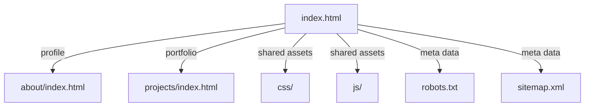
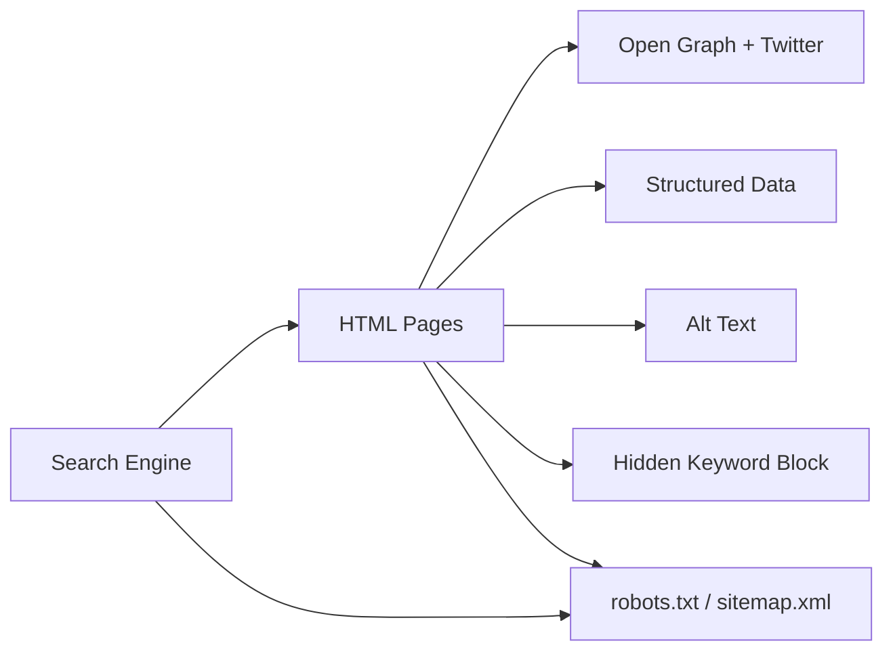

# PkLavc - Solutions Architect & Technical Owner

Official repository for my professional portfolio. 
Focusing on high-reliability systems, SRE-aware automation, and complex API ecosystems.

## Overview

This repository contains a static portfolio website for Patrick Araujo, focused on solutions architecture, systems engineering, API integration, automation, and data pipelines. The website is built using HTML, CSS and JavaScript and includes modern SEO improvements, structured data, and social sharing metadata.

The site includes three main pages:

- `index.html` — homepage with profile, skills and contact links
- `about/index.html` — detailed profile, professional history, clients and certifications
- `projects/index.html` — portfolio showcase of backend and integration projects

Additional files:

- `robots.txt` — indexation policy
- `sitemap.xml` — crawlable site map
- `css/` — stylesheet collection
- `js/` — frontend script assets
- `images/` — visual and icon assets

---

## Technology Stack

### Core Web Technologies

- **HTML5** — semantic page structure
- **CSS3** — responsive layout, color theme, and visual styling
- **JavaScript** — dynamic interactions, page behavior, and animations

### Libraries and frameworks

- **GSAP** — animation library loaded from CDN for motion effects
- **particles.js** — particle background animation engine
- **jQuery** — legacy DOM helper for existing page scripts

### SEO and Metadata

- **Open Graph** tags for rich social sharing
- **Twitter Card** metadata for Twitter previews
- **Canonical links** to avoid duplicate content issues
- **Schema.org JSON-LD** profile and page structured data
- **robots** index/follow instructions
- **Sitemap** configuration for search engines

---

## Page Structure and Purpose

### `index.html`

- Serves as the main landing page for a solutions and integration architect
- Contains a visible `<h1>` with the name, followed by descriptive `<h2>` content
- Implements particle background animation using `particles.js`
- Uses social media icons with descriptive `alt` text
- Includes a hidden `visually-hidden` SEO paragraph for technical keyword reinforcement
- Contains multiple JSON-LD blocks to represent profile and page schema

### `about/index.html`

- Provides the candidate’s professional profile, certifications, and company affiliations
- Uses detailed Open Graph and Twitter metadata
- Includes client logos and project references with proper `alt` descriptions
- Maintains a hidden `h1` plus visible `h2` for SEO semantics without altering layout
- Includes a hidden `visually-hidden` paragraph for architecture and enterprise keywords

### `projects/index.html`

- Displays a portfolio of backend, API integration, automation, and data pipeline work
- Uses `CollectionPage` JSON-LD with individual `CreativeWork` items defined in structured data
- Includes Open Graph and Twitter metadata tuned for project discovery
- Contains a hidden `h1` and visible `h2` heading for SEO semantics without visual change
- Includes a hidden semantic footer paragraph for robots

---

## File Structure

```text
PkLavc.github.io/
├── index.html
├── about/
│   └── index.html
├── projects/
│   ├── index.html
│   ├── google-auth-worker/
│   ├── zoho-integration-worker/
│   └── ...
├── robots.txt
├── sitemap.xml
├── css/
├── js/
├── images/
├── README.md
└── LICENSE.txt
```

---

## SEO Architecture

### Metadata and social sharing

- `meta name="description"` — supports search engine snippets
- `meta property="og:title"` — controls Facebook and LinkedIn shared title
- `meta property="og:description"` — supports enterprise and systems architecture messaging
- `meta property="og:image"` — profile image for social cards
- `meta name="twitter:card"` — summary_large_image for rich Twitter previews
- `meta property="og:image:alt"` and `meta name="twitter:image:alt"` — accessible image descriptions
- `canonical` — resolves the preferred URL

### Structured Data

Implemented JSON-LD schema types:

- `ProfilePage` for `index.html`
- `AboutPage` for `about/index.html`
- `CollectionPage` for `projects/index.html`
- `Person` profile metadata inside page schemas
- `CreativeWork` items for featured projects

### Robots and Sitemap

- `robots.txt` currently allows indexing for all crawlers and points to the sitemap
- `sitemap.xml` includes all published pages with `lastmod`, `changefreq`, and `priority`

---

## Accessibility and Semantic Enhancements

- `alt` attributes applied to all `` tags with descriptive phrases
- `aria-label` used on key profile and contact elements
- hidden `div.visually-hidden` paragraphs added for technical semantics using clipping instead of `display:none`
- visible page headings preserved while adding hidden `h1` for SEO semantics on secondary pages

---

## Performance and Script Loading

### Script loading strategy

- `jquery.min.js` loaded with `defer` to avoid render-blocking
- `particles.min.js` intentionally loaded without `defer` for inline `particlesJS(...)` initialization compatibility
- `index.js` loaded with `defer`
- `gsap.min.js` loaded from CDN with `defer`

### Observations

- The particle background depends on `particles.min.js`, so correct load order is essential
- Hidden SEO text is added without affecting visible layout
- The site uses client-side animations and progressive enhancement

---

## Visual / Interaction Design

The design uses:

- a dark theme with blue accent colors from `color-blue.css`
- particle animation in the hero section
- social media icon links for GitHub, LinkedIn, and email
- skill badges and technology icons in the core profile panel
- slide carousels and logo grids on the about page

---

## Mermaid Diagrams

### Site structure



### SEO data flow



---

## References and Resources

### Technology references

- [HTML5](https://developer.mozilla.org/docs/Web/Guide/HTML/HTML5)
- [CSS3](https://developer.mozilla.org/docs/Web/CSS)
- [JavaScript](https://developer.mozilla.org/docs/Web/JavaScript)
- [GSAP](https://greensock.com/gsap/)
- [particles.js](https://vincentgarreau.com/particles.js/)
- [jQuery](https://jquery.com/)
- [Schema.org JSON-LD](https://schema.org/docs/gs.html)
- [Open Graph protocol](https://ogp.me/)
- [Twitter Cards](https://developer.twitter.com/en/docs/twitter-for-websites/cards/overview/abouts-cards)

### SEO best practices used

- remove obsolete `meta keywords`
- include `canonical` links
- use `robots` and `sitemap`
- apply accessible image descriptions
- add structured data for profile and project pages
- use page-specific social metadata descriptions

---

## Notes

This README is designed to document the current portfolio site state and provide a full technical overview. If you want, I can also create a smaller `README` for GitHub deployment or a project-specific `README` for developers.
