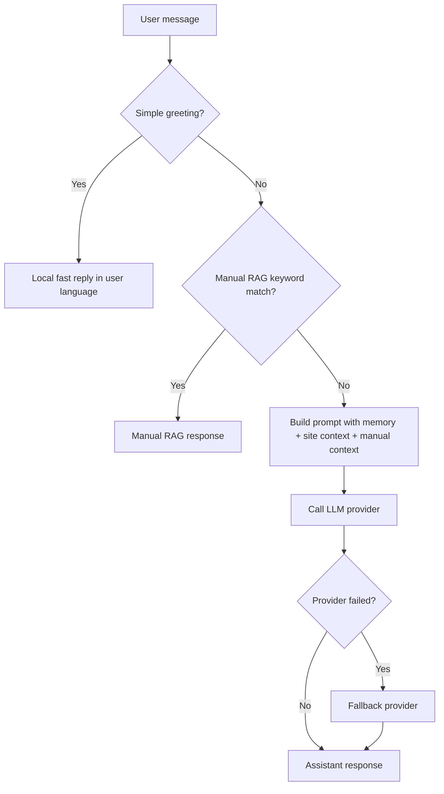

# PKLAVC Portfolio

Official repository for Patrick Araujo's portfolio website and Skyler chat assistant.

## Quick Status


## Overview

This repository contains:

- Static portfolio pages (home, about, blog, projects, collections, stacks)
- Shared frontend assets (CSS, JS, images)
- A production chatbot backend in `src/chatbot/worker` (Cloudflare Worker)
- Automation workflows for CI/CD and maintenance

## Current Structure

```text
PkLavc.github.io/
├── index.html
├── about/
├── blog/
├── collections/
├── projects/
├── stacks/
├── css/
├── js/
├── images/
├── src/
│   └── chatbot/
│       ├── scripts/
│       ├── worker/
│       │   ├── src/
│       │   │   ├── index.ts
│       │   │   └── manual-rag.ts
│       │   ├── migrations/
│       │   ├── test/
│       │   ├── package.json
│       │   └── wrangler.toml
│       ├── workflows/
│       └── docs/
├── robots.txt
├── sitemap.xml
├── README.md
└── LICENSE.txt
```

## Important Path Update

The chatbot path is now professionalized and centralized under `src/chatbot`.

- Old path: `testing/chatbot/...`
- Current path: `src/chatbot/...`

Production worker entrypoint:

- `src/chatbot/worker/wrangler.toml`
- `main = "src/index.ts"` (inside the Worker folder)

## Skyler Assistant

### Skyler Button Image

Skyler launcher icon used in the global floating chat widget:


### Skyler Badges


### Skyler Runtime Flow



### Skyler Frontend Interaction Flow

```mermaid
flowchart LR
    I[Skyler icon button] --> W[Open/Close chat widget]
    W --> T[Type message]
    T --> E[Enter sends | Shift+Enter newline]
    E --> C[POST /chat]
    C --> R[Render response]
    R --> V{Voice mode on?}
    V -- Yes --> S[Speech synthesis]
    V -- No --> N[Text only]
```

### Skyler Components

- Global widget loader: `js/index.js` (auto-injects widget assets)
- Frontend widget script: `js/skyler-widget.js`
- Frontend widget styling: `css/skyler-widget.css`
- Dedicated assistant demo page: `projects/skyler-assistant/demo/index.html`
- Worker API logic: `src/chatbot/worker/src/index.ts`
- Manual RAG knowledge: `src/chatbot/worker/src/manual-rag.ts`

### Skyler Behavior (Current)

- Global floating widget across site pages
- Lightweight orchestration on Worker
- Local fast greeting for simple greetings (`olá`, `hello`, etc.)
- Intent-aware portfolio RAG only for portfolio topics
- Cached site context merged with internal profile context for companies, projects, and credentials
- Direct LLM answer for off-topic prompts
- Plain-text response rules for course, company, and project answers
- Provider fallback when API fails

## Tech Stack

### Frontend

- HTML5, CSS3, JavaScript
- GSAP
- particles.js
- jQuery (legacy compatibility)

### Backend Chat

- Cloudflare Worker (TypeScript)
- D1 (chat records, prompts, analytics)
- KV (`CACHE`, `SESSIONS`)
- Groq + OpenRouter provider strategy

## SEO and Metadata

Implemented across core pages:

- Open Graph and Twitter metadata
- Canonical URLs
- Schema.org JSON-LD blocks
- robots/sitemap support

## Operational Notes

- Chatbot CI/CD workflows already point to `src/chatbot/...`
- Worker deploy uses `src/chatbot/worker`
- Manual RAG is source-controlled for predictable context grounding

## Useful Commands

From `src/chatbot/worker`:

```bash
npm install
npm run lint
npm run typecheck
npm run test
npm run deploy -- --dry-run
```

## References

- Site: https://pklavc.com
- About: https://pklavc.com/about/
- Projects: https://pklavc.com/projects/
- Blog: https://pklavc.com/blog/
- GitHub: https://github.com/PkLavc
