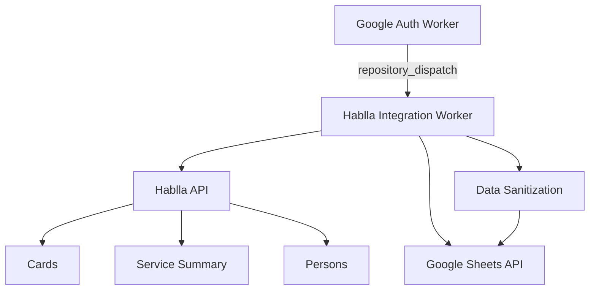

# Hablla Integration Worker

A Node.js integration worker that synchronizes operational Hablla data into Google Sheets for analytics, attendance monitoring, and CRM-style customer base enrichment.

## Overview

This worker is part of an event-driven integration chain. It receives Google OAuth tokens from the auth worker, authenticates with Hablla APIs, and executes three synchronized pipelines:

1. Card synchronization (`Base Hablla Card`)
2. Attendant performance summary (`Base Atendente`)
3. Customer/person export (`Base Cliente`)

The implementation includes deduplication, API throttling, data sanitization, and safe logging practices for public repository operations.

## System Architecture



## Core Features

- Incremental card synchronization with `updated_after` filtering
- Security cleanup window (last 7 days) before appending fresh data
- Duplicate cleanup by unique card ID on `Base Hablla Card`
- Attendant KPI ingestion (TME, TMA, CSAT, FCR)
- Customer/person export with normalized contact/tag/custom-field mapping
- Spreadsheet formula injection prevention via sanitize function
- Secure execution model with masked-sensitive logging behavior
- Rate-limiting between API calls to reduce provider throttling risk

## Data Pipelines

### 1. Base Hablla Card

The worker:

1. Authenticates to Hablla
2. Reads recent rows from `Base Hablla Card`
3. Deletes recent rolling-window rows (safety cleanup)
4. Fetches paginated cards from Hablla
5. Maps custom fields and card metadata
6. Appends rows to Google Sheets
7. Rebuilds data deduplicated by card ID

### 2. Base Atendente

The worker requests daily service summary metrics from Hablla and appends per-agent rows containing:

- service totals
- TME/TMA metrics
- connection metadata
- CSAT indicators
- FCR counters

### 3. Base Cliente

The worker fetches persons/clients by date window and exports:

- primary phone and WhatsApp indicator
- flattened email list
- sectors and tags
- fixed custom field IDs mapped to dedicated columns
- dynamic extra fields serialized into an "other fields" column

## Security Controls

- **Sanitization**: Prefixes high-risk strings starting with `=`, `+`, `-`, `@`
- **Public-safe logging**: Avoids exposing sensitive payload details
- **Secrets-only auth**: Credentials and tokens are environment-injected only
- **Least-privilege workflow model**: Runs only required steps in GitHub Actions

## Configuration

### Required Environment Variables

```bash
GOOGLE_TOKEN=oauth_access_token_from_google_auth_worker
HABLLA_EMAIL=your_hablla_email
HABLLA_PASSWORD=your_hablla_password
HABLLA_WORKSPACE_ID=workspace_identifier
HABLLA_BOARD_ID=board_identifier
SPREADSHEET_ID=target_google_spreadsheet_id
```

### GitHub Actions Trigger

This worker is triggered by:

```yaml
on:
	repository_dispatch:
		types: [google_token_ready]
```

## Reliability Notes

- Uses controlled sleep intervals between Hablla requests
- Uses bounded pagination to avoid unbounded loops
- Handles missing optional tabs (`Base Cliente`) gracefully
- Wraps execution in controlled try/catch for operational stability

## License

This project is licensed under the MIT License. See [LICENSE](LICENSE).

## Author

**Patrick Araujo - Computer Engineer**  
**GitHub**: https://github.com/PkLavc  
**Portfolio**: [https://pklavc.github.io/projects.html](https://pklavc.github.io/projects.html)

---

*Hablla Integration Worker - Production-oriented data synchronization for operational analytics and customer intelligence pipelines.*

[](https://github.com/sponsors/PkLavc)
