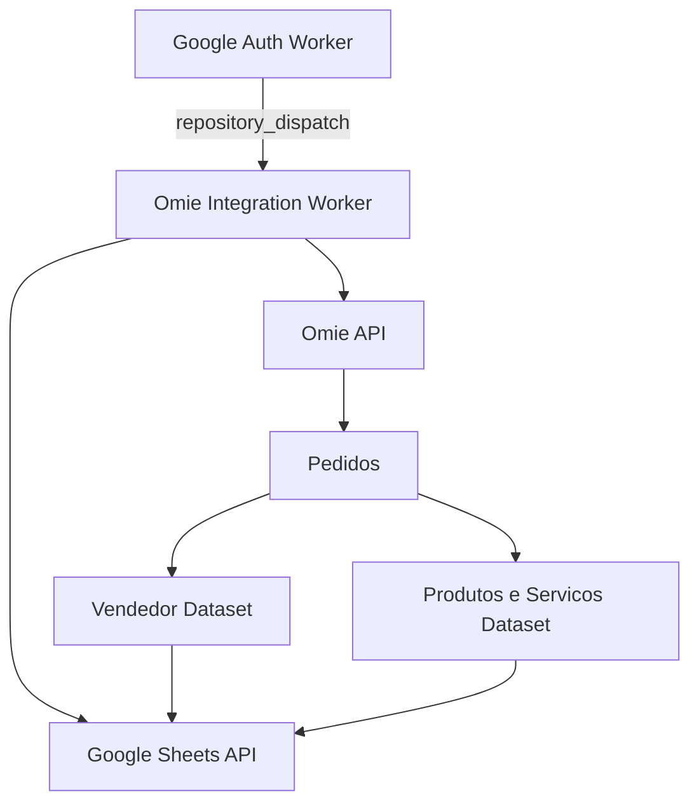

# Omie Integration Worker

A Node.js ETL worker that extracts Omie sales order data and synchronizes normalized seller and product/service datasets into Google Sheets.

## Overview

This worker is designed for lightweight reporting pipelines where Omie commercial data needs to be centralized in spreadsheet workflows.

The integration focuses on two analytical targets:

- `Vendedor` sheet (seller-level sales rows)
- `Produtos e Servicos` sheet (line-item level rows)

## Architecture



## Implementation Components

### `index.js`

- Receives OAuth token for Google Sheets
- Defines date window (`DATA_INICIO` / `DATA_FIM` or current day)
- Calls Omie listing service
- Splits payload into seller and item-level datasets
- Appends rows to target sheets

### `omieService.js`

- Wraps Omie API requests using axios
- Injects `APP_KEY` and `APP_SECRET` from environment
- Implements recursive pagination (`ListarPedidos`)
- Adds anti-formula sanitization before output write

## Core Features

- Recursive pagination support for complete period extraction
- Structured transformation for seller and product analytics
- Safe append-only writes to existing Google Sheets tabs
- Formula injection mitigation with string sanitization
- Minimal secure logging with execution status semantics

## Configuration

### Required Environment Variables

```bash
APP_KEY=your_omie_app_key
APP_SECRET=your_omie_app_secret
GOOGLE_TOKEN=oauth_access_token
SPREADSHEET_ID=target_spreadsheet_id
DATA_INICIO=optional_dd/mm/yyyy
DATA_FIM=optional_dd/mm/yyyy
```

## Workflow Trigger

The repository workflow is configured for dispatch-based runs and manual dispatch:

```yaml
on:
	repository_dispatch:
		types:
			- report_token_ready
	workflow_dispatch:
```

## Output Model

### Vendedor

- date
- seller name
- order total
- order number

### Produtos e Servicos

- date
- item description
- quantity
- unit price
- seller name

## Security Notes

- API credentials are never hardcoded
- Environment-injected secrets are required at runtime
- Sanitization prevents spreadsheet formula payload injection

## License

This project is licensed under the MIT License. See [LICENSE](LICENSE).

## Author

**Patrick Araujo - Computer Engineer**  
**GitHub**: https://github.com/PkLavc  
**Portfolio**: [https://pklavc.github.io/projects.html](https://pklavc.github.io/projects.html)

---

*Omie Integration Worker - Practical ETL pipeline for ERP sales intelligence and spreadsheet-driven operations.*

[](https://github.com/sponsors/PkLavc)
