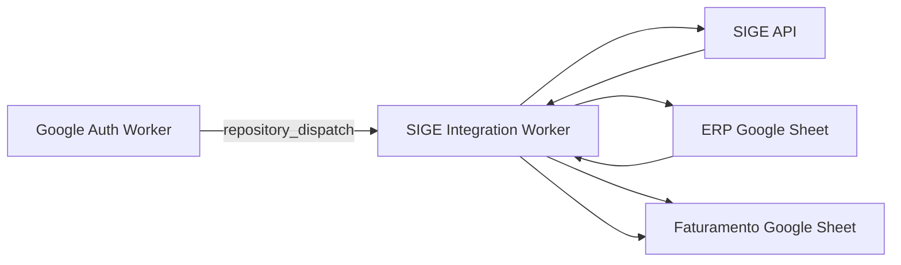

# SIGE Integration Worker

A Node.js integration worker that synchronizes billed SIGE orders to Google Sheets, enriches records with ERP correlation logic, and calculates attribution fields for operational finance reporting.

## Overview

This worker ingests billed orders from SIGE, enriches each record by searching historical ERP rows, and writes normalized datasets to a `Faturamento` sheet.

It supports:

- daily automatic synchronization via repository dispatch
- mass historical backfill mode (`em_massa.js`) for date-range replay
- cross-source attribution logic (Novo vs Retirada)

## Architecture



## Processing Logic

### Daily Sync (`index.js`)

1. Read the most recent ERP block (last 25k rows)
2. Query SIGE billed orders for yesterday
3. Optionally query SIGE people endpoint for contact enrichment
4. Correlate by CPF and classify related ERP events
5. Compute `Novo` and `Retirada` serial-date references
6. Split value logic when prior withdrawal is detected
7. Append final structured rowset to `Faturamento`

### Mass Sync (`em_massa.js`)

The manual workflow executes a controlled date-range replay to rebuild historical windows while preserving the same business mapping rules.

## Key Features

- ERP correlation by CPF for salesperson attribution
- Excel serial-date generation for deterministic matching
- Financial split logic for withdrawal-linked orders
- Spreadsheet formula injection protection (`sanitize`)
- Secure operational logs with timestamped severity labels
- API throttling in batch mode for stability under provider limits

## Security and Data Integrity

- Sanitizes user-generated text before writing to Sheets
- Uses secrets-only credentials for SIGE and Google APIs
- Avoids unsafe direct formula writes
- Includes controlled error exits for CI observability

## Configuration

### Required Environment Variables

```bash
SIGE_TOKEN=your_sige_token
SIGE_USER=your_sige_user
SIGE_APP=your_sige_app
GOOGLE_TOKEN=oauth_access_token
SPREADSHEET_ID=destination_sheet_id
ERP_SPREADSHEET_ID=erp_source_sheet_id
```

## Workflow Triggers

### Automatic

```yaml
on:
	repository_dispatch:
		types:
			- google_token_ready
```

### Manual Backfill

```yaml
on:
	repository_dispatch:
		types:
			- report_token_ready
```

## Output Schema (High-Level)

The resulting `Faturamento` rows include:

- customer contact and CPF
- order and invoice identifiers
- order status and billed date
- order value and adjusted split value
- salesperson references (Novo and Retirada)
- month/year partition key

## License

This project is licensed under the MIT License. See [LICENSE](LICENSE).

## Author

**Patrick Araujo - Computer Engineer**  
**GitHub**: https://github.com/PkLavc  
**Portfolio**: [https://pklavc.github.io/projects.html](https://pklavc.github.io/projects.html)

---

*SIGE Integration Worker - ERP-aware billing synchronization for finance-grade operational reporting.*

[](https://github.com/sponsors/PkLavc)
